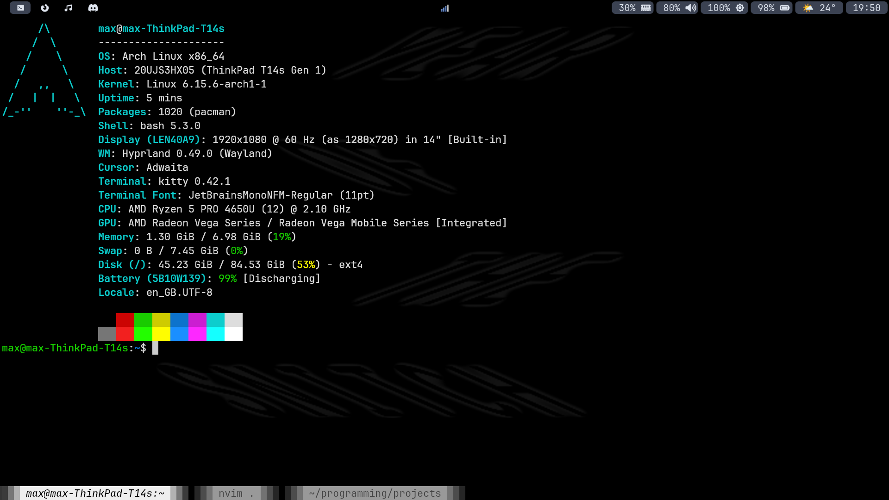

# My Dotfiles

<div align="center">
    <br/>
    
    
</div>

## Installation

The expected use case is an Arch Linux installation with Sudo setup for the user account. If you're using an Nvidia graphics card, make sure you've installed a suitable driver using [the wiki](https://wiki.archlinux.org/title/NVIDIA) and have rebooted since. Then follow the steps below:

1. Run setup script with:

   ```
   bash <(curl https://raw.githubusercontent.com/mcttn22/dotfiles/refs/heads/main/.github/setup.sh)
   ```

2. Select "Hyprland" as the session (not "Hyprland (uwsm-managed)")

3. Apply the following manual configurations:

    1. Replace the monitor details in ~/.config/hypr/hyprland.conf with the details outputted by `hyprctl monitors all`

    2. Set the wallpapers with:

      - Home:
        ```
        ln -s absolute-path-to-image ~/Pictures/home-wallpaper
        ```

      - Lock screen:
        ```
        ln -s absolute-path-to-image ~/Pictures/lock-screen-wallpaper
        ```
    
      - SDDM:
        ```
        sudo cp absolute-path-to-image /usr/share/sddm/themes/Sugar-Candy/Backgrounds/wallpaper
        ```

    3. Add `--location` flag with a value (e.g. Postcode) to `wttrbar` command in ~/.config/waybar/config.jsonc for accurate weather

    4. Apply changes by exiting and re-entering Hyprland with `Super+L`

    *Note: Electron / Chromium based applications (e.g. Discord) require adding the `--enable-features=UseOzonePlatform --ozone-platform=wayland` flags to their executable for native Wayland support. This can be done by adding a desktop entry with the flags to ~/.local/share/applications/*

## Updating

You can stay up to date with the latest configuration by running `dotfiles pull`

*Note: To apply SDDM theme configuration updates, you have to run ```sudo cp ~/.config/sddm/themes/Sugar-Candy/theme.conf /usr/share/sddm/themes/Sugar-Candy/theme.conf.user```*

## License

MIT License

Copyright (c) 2025 Max Cotton

Permission is hereby granted, free of charge, to any person obtaining a copy
of this software and associated documentation files (the "Software"), to deal
in the Software without restriction, including without limitation the rights
to use, copy, modify, merge, publish, distribute, sublicense, and/or sell
copies of the Software, and to permit persons to whom the Software is
furnished to do so, subject to the following conditions:

The above copyright notice and this permission notice shall be included in all
copies or substantial portions of the Software.

THE SOFTWARE IS PROVIDED "AS IS", WITHOUT WARRANTY OF ANY KIND, EXPRESS OR
IMPLIED, INCLUDING BUT NOT LIMITED TO THE WARRANTIES OF MERCHANTABILITY,
FITNESS FOR A PARTICULAR PURPOSE AND NONINFRINGEMENT. IN NO EVENT SHALL THE
AUTHORS OR COPYRIGHT HOLDERS BE LIABLE FOR ANY CLAIM, DAMAGES OR OTHER
LIABILITY, WHETHER IN AN ACTION OF CONTRACT, TORT OR OTHERWISE, ARISING FROM,
OUT OF OR IN CONNECTION WITH THE SOFTWARE OR THE USE OR OTHER DEALINGS IN THE
SOFTWARE.

